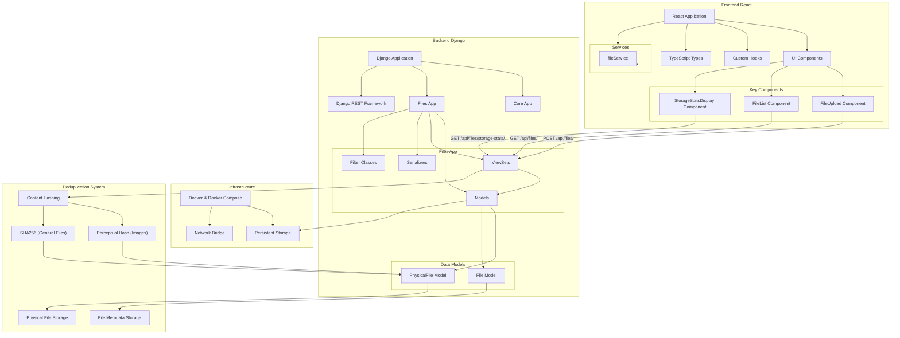

```mermaid
graph TD
    subgraph "Frontend React"
        FE["React Application"]
        Components["UI Components"]
        Services["API Services"]
        Hooks["Custom Hooks"]
        Types["TypeScript Types"]
        
        FE --> Components
        FE --> Services
        FE --> Hooks
        FE --> Types
        
        subgraph "Key Components"
            FileUpload["FileUpload Component"]
            FileList["FileList Component"]
            StorageStats["StorageStatsDisplay Component"]
        end
        
        Components --> FileUpload
        Components --> FileList
        Components --> StorageStats
        
        subgraph "Services"
            FS["fileService"]
        end
        
        Services --> FS
    end

    subgraph "Backend Django"
        Django["Django Application"]
        Core["Core App"]
        Files["Files App"]
        REST["Django REST Framework"]
        
        Django --> Core
        Django --> Files
        Django --> REST
        
        subgraph "Files App"
            Models["Models"]
            Views["ViewSets"]
            Serializers["Serializers"]
            Filters["Filter Classes"]
        end
        
        Files --> Models
        Files --> Views
        Files --> Serializers
        Files --> Filters
        
        subgraph "Data Models"
            PhysicalFile["PhysicalFile Model"]
            FileModel["File Model"]
        end
        
        Models --> PhysicalFile
        Models --> FileModel
    end

    subgraph "Infrastructure"
        Docker["Docker & Docker Compose"]
        Storage["Persistent Storage"]
        NetworkBridge["Network Bridge"]
        
        Docker --> Storage
        Docker --> NetworkBridge
    end
    
    FileUpload -- "POST /api/files/" --> Views
    FileList -- "GET /api/files/" --> Views
    StorageStats -- "GET /api/files/storage-stats/" --> Views
    
    Views --> Models
    Models --> Storage

    subgraph "Deduplication System"
        ContentHashing["Content Hashing"]
        pHash["Perceptual Hash (Images)"]
        SHA256["SHA256 (General Files)"] 
        FileStorage["Physical File Storage"]
        MetadataStorage["File Metadata Storage"]
    end
    
    PhysicalFile --> FileStorage
    FileModel --> MetadataStorage
    Views --> ContentHashing
    ContentHashing --> pHash
    ContentHashing --> SHA256
    pHash --> PhysicalFile
    SHA256 --> PhysicalFile
```
